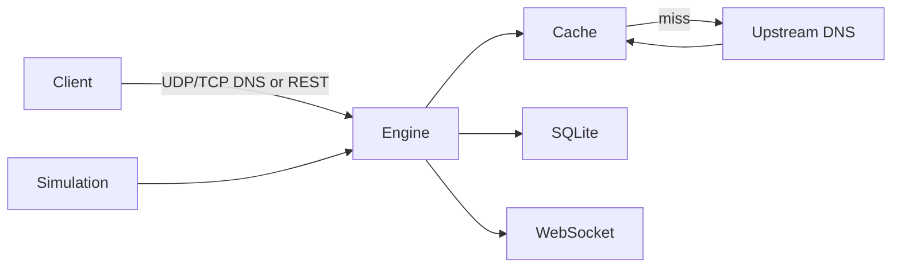

# Mini DNS Server with Live Caching Analytics

An educational Computer Networks backend that is both a local DNS proxy and a FastAPI analytics service. It forwards genuine DNS packets to configured upstream resolvers, caches successful replies using DNS TTLs, and records measured outcomes in SQLite.

## Run

```powershell
python -m venv venv
venv\Scripts\activate
pip install -r requirements.txt
Copy-Item .env.example .env
python run.py
```

API docs: `http://127.0.0.1:8000/docs`; DNS listener: `127.0.0.1:5353`.

Run the frontend in a second terminal:

```powershell
cd frontend
Copy-Item .env.local.example .env.local
npm install
npm run dev
```

Open the operations console at `http://localhost:3000`.

Try a manual resolution:

```powershell
Invoke-RestMethod -Method Post http://127.0.0.1:8000/api/dns/query -ContentType application/json -Body '{"domain":"google.com","record_type":"A"}'
nslookup -port=5353 google.com 127.0.0.1
```

The first lookup is a cache `MISS` and is forwarded through UDP (or TCP when chosen); a later lookup is a `HIT`, returns the stored DNS packet, and exposes a lower measured response time. Entries are never returned after expiration and cache capacity uses LRU eviction.

## Architecture



`app/dns` handles real packet forwarding and the dual-protocol server. `app/cache` implements TTL/LRU. `app/database` persists query history. `app/simulation.py` feeds the same engine with weighted domains. `docs/API.md` is the frontend contract.

## Test

```powershell
pytest -q
```

Configuration is in `.env` (copy `.env.example`). DNS normally uses UDP for ordinary small queries; TCP is supported for larger/special DNS exchanges and uses DNS's two-byte length framing. This project demonstrates application-layer DNS, client-server forwarding, UDP/TCP, IP addressing, cache TTL, latency measurement, traffic load, and real-time monitoring.
